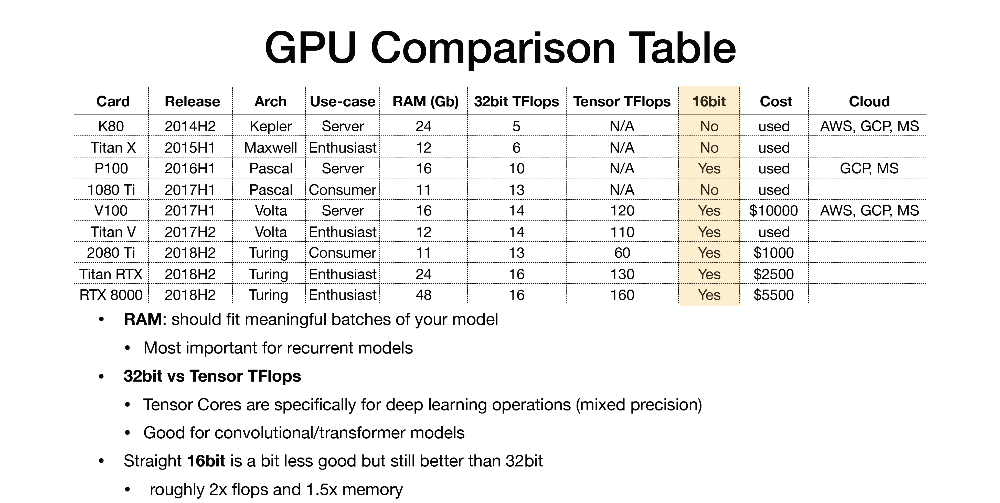
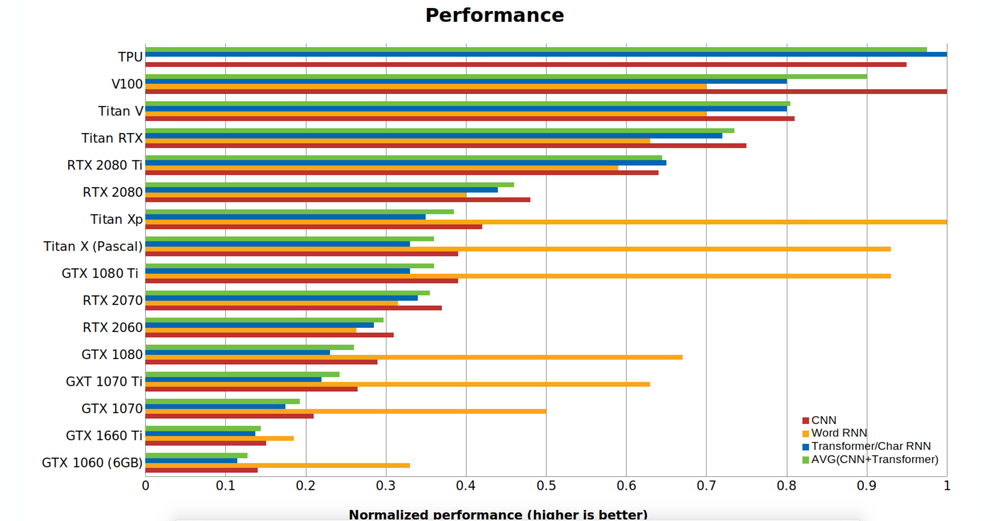

# ML Computing Hardware:

ML is heavily relied on computing hardwares. When talking about compute needs, we can basically divide the needs into three categories: 

Development Needs, Training needs, and inference needs.

- Development needs:
    writing/debugging/validating = > local desktop or cloud instance with GPU.

- Training needs:
    train your model in the scale => local GPU clusters or cloud GPU clusters

- Inference needs:
    take the trained model and make predictions => local scalable GPU clusters or cloud GPU clusters, or edge device with CPU,GPU or FPGA 

CPU:
- fewer cores, but more powerful cores.

GPU: 
- Lots of cores, but dumber cores.
- Nvidia V.S. AMD
    - Nvidia:
         GTX 1080 Ti => Titan RTX (tensor core: specialized hardware for 4x4 matrix multiply, mixed precision)
    - Programming GPUs:
        - CUDA (Nvidia only): c like code runs directly on GPU. 
        - OpenCL: similar to CUDA but runs on anything. 
- Google TPUS:
    - Fastest option 
    - Only on GCP

 
 

FPGA:

- An FPGA provides an extremely low-latency, flexible architecture that provides deep learning acceleration in a power-efficient solution.