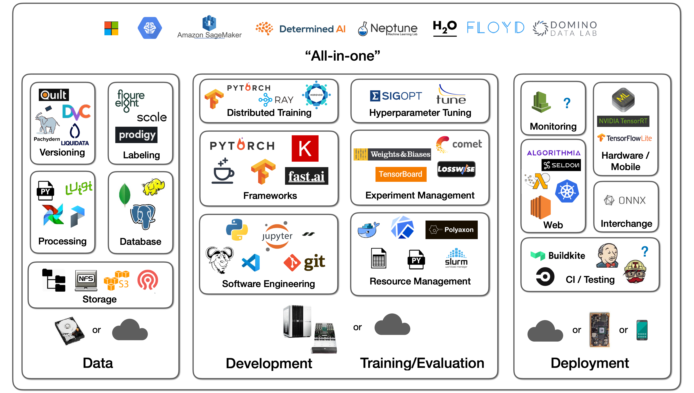
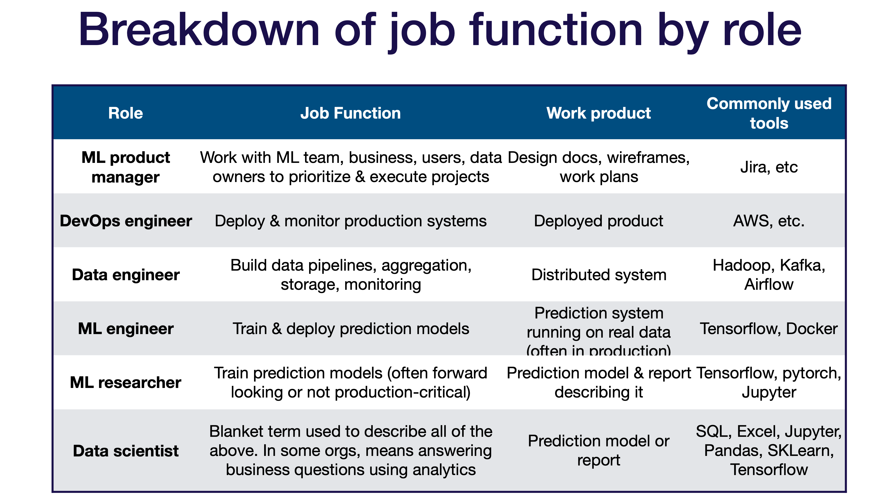
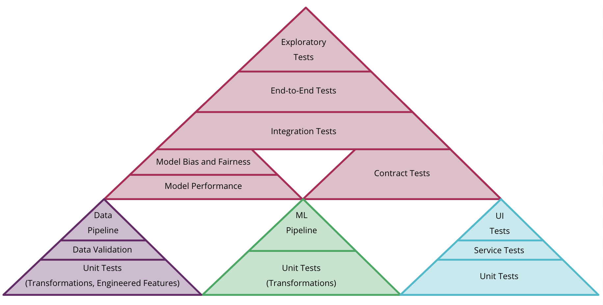

# Phase 1: Business Understanding and Project Planning

Make great Machine Learning Product is hard, but not impossible. Instead of starting from a ML problem, a deep understanding of the business requirements is the key to the success of a ML project.

## Understanding business requirements
Machine learning is getting ready for business, but are businesses ready for AI? Technical challenges are an important differentiating factor between industries. While big tech and academia are pushing advances in the performance of the underlying technology, engineering solutions need to be worked out for specific use cases, requiring both data and talent. Industries such as financial services, and high tech and telecom have generated and stored large volumes of structured data, but others, including construction and travel, lag far behind. Considering the various digital stages of different businesses, each machine learning project has to be specially designed based on deep understanding of the business requirements.

### 1. Form a business question:

Depends on whether the project is driven by the CIO or CFO, business might have different expectations for the ML product. The first step before diving into the ML solutions, is to ask a business question: From the business point of the view, what do you want?

For example, the business question can be:
    -  How can we improve the click-through rates of our ads?
    -  How can we reduce the human labors in spam email identification?
    -  How to stay competitive and catch the trend of AI?

It might sound a little discouraging, but ML products sometimes are not the best solutions to these questions. If you keep that in mind and try not to plug ML in every place, you've got a great start for a ML project.

### 2. Understand the nature of a ML product

Unlike most software projects, ML projects now still involved with some research work more or less. The solutions of the ML projects are not clear and obvious, therefore can't proceed with a SE project mindset.

Machine learning products can be roughly classified into two categories: Engineering product or R&D product.

- Engineering Product:

    Unless you're tech giants or digital native companies like Google, Amazon, etc, most ML products should fall in this category. Most of the problems you will face are, in fact, engineering problems. Most companies won’t focus on developing ML models but will use an off-the-shelf model. For such businesses, having a reliable and easy to maintain ML application can make a huge boost to their revenue, while spending months to fine-tune the newest model appeared in the academia probably doesn't fit into their business requirement.

    Therefore, as a ML engineer, you have to temperately disable the "mathematician" part of you and release the "engineer" part of you. And repeat after me: No fancy algorithms! No complex pipelines! Easy and stable!

- Research and Development Product
        
    If a business has a R&D product plan for machine learning, they are serious of making big impacts in this field. Most of the time they are equipped with talents and experts, and what they want from us is normally more in a management level instead of technical level. This is not very common for an engineer to step in such machine learning projects, actions depend on case by case.

Therefore, a clear definition of the kind of the ML product should be discussed in this stage.

## Analyzing supporting information

Machine learning is no longer a stand-alone module of you whole tech stack. To deploy a successful ML project, We need many supporting informations such as tools and infrastructures, and the team.

Therefore, it's necessary to take a look at all the supporting structures you have or have to introduce during this project.

### 1. Infrastructure

The picture below can be a good starting point when considering tools and infrastructures you want to use for this project.

### 2. Team

Building any tech team is hard. Machine Learning talents are expensive and scarce. Machine Learning teams have a diverse set of roles. Machine Learning projects have unclear timelines and high uncertainty. Machine Learning is also the “high-interest credit card of technical debt." Leadership often doesn’t understand Machine Learning. All these challenges make building ML team quite hard.

#### Roles

#### Organization

#### Managing

Manage Machine Learning projects can be very challenging:
- In Machine Learning, it is hard to tell in advance what’s hard and what’s easy.
- Machine Learning progress is nonlinear.
- There are cultural gaps between research and engineering because of different values, backgrounds, goals, and norms.
- Often, leadership just does not understand it.

The secret sauce is to plan the Machine Learning project probabilistically!
- Attempt a portfolio of approaches.
- Measure progress based on inputs, not results.
- Have researchers and engineers work together.
- Get end-to-end pipelines together quickly to demonstrate quick wins.
- Educate leadership on Machine Learning timeline uncertainty.

## Converting Business question into a Machine Learning question

Now we have a understanding of what the business questions is and what resources we have (or have to introduce). It's time to convert the business question into a ML question. 

### 1. Review Business question and create business goals

The first step is to review the business question and create clear business outcomes from the project. For example, if my business question is:

'How can we improve the click-through rates of our ads?' 

The the business goals should be set as:

'Improve click-through rates by 10% with the ML model'

So why we need to set business goals? Can't we just set a machine learning objective and if the ML model meets the objective then we're good to go? Well, an interesting finding is that model performance does not necessarily translate into a gain in business value. We will talk about this in the evaluation session, but just keep this in mind: a good ML model doesn't generate business value.

### 2. Convert to ML question and objective

Now it's time to convert the business question into machine learning question and create machine learning goals. We need to keep in mind that not all business problems can be converted into ML problems. Sometimes ML is not the best solution and we should definitely always be aware of it.

A good ML project should be able to make "cheap predictions" to automate "complicated" manual processes.

Let's continue with our click-through rates of ads example. In order to convert this into ML problem, we need to make a few assumptions. For example, we make two assumptions below:

Assumption 1: The longer the users stay on our site, the higher chance they click our ads.
Assumption 2: The user tends to click ads more related to their interest.

These assumptions need to be validated with historical data, but let's assume we validated assumption 2 is true and the business question has turned into:

'We can improve click-through rates of the ads by pushing personalized ads to each user'

Then it's very clear right now how the ML problem will be framed:

'We need to create a ML model can take users' profile/history as input and output the key word of the user's interest'

Without ML, this process might be not possible or very complicated. With ML based on user's data, this is achievable. Therefore, converting this business question into ML question is doable.

Finally, the objective of the ML model should be:

'The model can predict the key word of users' interest with an accuracy of 0.8'

We should keep in mind that the exact metrics we should use to measure the model evaluation should be carefully designed based on business needs, and the value needs to be tested as well. We used 'accuracy' here as an example. In real world, you should ask yourself, how costly are wrong predictions? for self-driving cars, wrong predictions are deadly, but for content recommendations, a wrong prediction is not a big deal. 

## Preparing a preliminary plan

Now we have a business question expressed by a machine learning question, we need to prepare a preliminary plan. Because of the nature of ML projects, sometimes the plan will change and it's totally fine. With this plan, we try to build up the baseline of the ML pipelines and ensure every phase should be connected. 

Besides question and objectives, I listed some key questions one should consider when scratching out the plan:

1. Data availability:

    This may get ignored quite often and we've seen many ML projects fail at the data collection stage. Before we even start this project, we need to ask questions like:

    how hard it is to acquire data?

    how expensive is data labeling?

    how much data will be needed?

    Where the data is? on-prem or cloud?

    We need to have a basic idea of the data availability before starting.

2. State of Art ML model in your domain:

    This part is like the literature research. We need to understand what's possible with current techniques and know what to try next. Take the ads again as an example, we know we can use collaborative filtering method in machine learning to build a recommendation system to predict user's preference. Then we need to spend time understanding the current limitation and advances in this field. What is the most common models to try? What is the most cited paper? How about other industry use cases?

3. Tools and infrastructures:

    If we look at the whole machine learning system, the actual modeling code is very small. There are a lot of other code around it that configure the system, manage the data and resources, serve/deploy/moniting the model. Therefore, it's important to think ahead what tools and infrastructures you have access to in your business, what talent you already have and might have to introduce, what tools and infrastructure are on the market and worth to investigate in.

    This recently becomes a question for many firms, should you use off-the-shelf ML tools to build your ML product, or invent your own? Again, there are many factors affecting the decision making process such as cost, stability, scalability, talent, etc. 

    

4. Model Evaluation Metrics:

    In most real-world projects, you usually care about a lot of metrics. Because ML systems work best when optimizing a single number, you need to pick a formula for combining different metrics of interet. This metrics should be designed in the beginning of the project and it can change over time. Common metrics are: precision, recall, f1-score, mAP, etc.

    Coming to pick the right one to use, we often will first start enumerating all the project requirements, then evaluate the current performance of the baseline model, then compare the performance to the requirements, and finally revisit the matrix as your numbers improve.

5. Difficulties and Risks:

    ML is still new, a published paper of a ML model doesn't mean a promising model can be built for your business. We need to be fully aware of difficulties and risks associated with our ML product.

    For example, newer methods and papers mean more risks and more technical effort.

    We also need to consider computational cost of predicitions and it's feasibility in your production environment.

    Overall, unsupervised learning and reinforcement learning are still hard problems in machine learning.

6. How the model is going to be deployed and make predictions:

    Depends on where and how the model is going to be deployed, the ML pipeline can be structured very differently.

    Where: We can deploy models on local computer clusters, on the cloud or on small edge devices.
    How: We can make batch predictions, or online near real-time predictions, or real-time predictions.

    Thinking of our ads example again, if we want each user to be able to access the output of the models no matter using laptop, cellphone, or pads, then this model has to be deployed on local computer clusters with reliable internet access, or on the cloud. We shouldn't consider deploying this model on phones/laptops.

    Also, if we want to make predictions based on the most recent user activities such as recent clicks, view pages, etc, then batch predictions might not be the most accurate option since the input of the model is lack of the most recent activities. We should try to use near real-time online predictions. We don't really need real-time prediction since we can update the recommendations every 10 mins, so very costly real-time predictions can be avoided.

7. Create a Baseline Model:

    A baseline is a model that is both simple to set up and has a reasonable change of providing decent results. 

    - External baselines: business and engineering requirements, published results
    - Internal baselines: simple ML models with regression or simple classification, human performance.

    Then when the project starts, we can easily refer to this baseline and exam our models.

8. Test-driven Machine Learning:

    In traditional software development, code must be tested in a variety of ways before being promoted to production. For example, unit tests examine specific units of code while integration tests test the integration of your app with with software that lives outside of the application.

    It’s important to test a machine learning model before promoting it to production. By properly testing a model you’ll gain confidence that the model works as intended.

    Test a ML system is more complex than testing a software. For each phase in the ML pipeline, tests need to be conducted and planned ahead.

     

