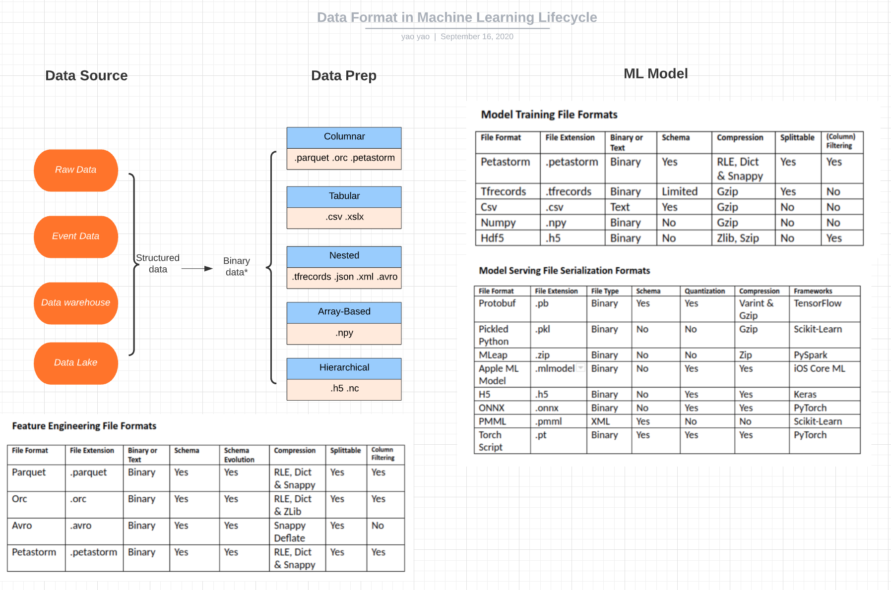

# Phase 2: Data Collection and Preparation

Data Science has never been as much about machine learning as it has about cleaning, shaping, and moving data from place to place. Therefore, Data is the first part we should consider before even starting the modeling.

The topics we're going to cover is:

- Data Collection
- Data Storage
- Data Quality and Properties
- Data Labeling
- Data Versioning
- Data Processing

## Data Collection:

First we need to identify data sources and associated platforms. Where are your current data stored and what data can be used to train your model?

Let's take our ads example. Recall our ML question from Phase 1: We need to create a ML model can take users' profile/history as input and output the key word of the user's interest'. So where can we extract user's profile and history?

For more static user profile like age, gender, address, purchase history, etc, they should be stored in your data warehouse or logs in some format. Now it's the data engineer's job to find the data and extract them in correct format.

For dynamically changing user properties such like click history, probably this part of data has never been recorded or used in your company because they are useless before. Therefore, now it's time to introduce click-stream pipeline to record and collect these data.

It's good to consider other data sources like online public dataset, synthetic data, and domain knowledge, etc. Data flywheel can also be helpful, which means as you roll out your model, you ask your user to input more data in some way.

## Data Storage:

Then it's time to consider how to store your data for your ML project. The four major options are:

- Filesystem
    The filesystem is the foundational layer of storage. Its fundamental unit is a “file” — which can be text or binary, is not versioned, and is easily overwritten.

- Object storage
    Object storage is an API over the filesystem that allows users to use a command on files (GET, PUT, DELETE) to a service, without worrying where they are actually stored. Its fundamental unit is an “object” — which is usually binary (images, sound files…).

- Database
    The database is a persistent, fast, and scalable storage/retrieval of structured data. Its fundamental unit is a “row” (unique IDs, references to other rows, values in columns).

- Data Lake
    A data lake is the unstructured aggregation of data from multiple sources (databases, logs, expensive data transformations). It operates under the concept of “schema-on-read” by dumping everything in and then transforming the data for specific needs later.

When planning out what goes where, binary data like images, sound files, compressed texts should be stored as objects. Metadata like labels, user activity should be stored in database. You can also set up a centralized data lake to handle the raw and mixed data and then set up separated ETL to process the raw data. When start training, the training data should be copied onto the local filesystem which is closest to your GPU.

Another thing needs attention is the data format you're going to use in the whole pipeline. A graph can be used as a good decision-making helper:

## Data Quality and Properties:

We need quality control of raw data as well to ensure we collect the data we want and store them correctly. Common tasks are:

1. Verifying attributes
2. Identifying missing data
3. Reveal inconsistencies
4. Report solution

On the same time, we want to do some basic data exploration as well with tools and techniques to explore data properties.

## Data Labeling:

Data Labeling is an essential part for all kinds of supervised machine learning. Companies often spend a lot of time and money to get their data labeled properly for training. There are basically two options: label by your own or outsource the labeling.

Considering data labeling requires separated software stack, temporary labor, and quality assurance, it makes sense to outsource your labeling. However, this always comes with a cost. If you think full-service data labeling is pricy, then you can consider labeling software without labor.

Some full-service labeling company:

- FigureEight
- Scale.ai
- Labelbox
- Supervisely
- Amazon Turk

Some labeling software:

- Prodigy

## Data Versioning:

Data versioning is a special request for machine learning. The ML model is closely related to the data you use to train it. Therefore, every deployment of the ML model, is actually a deployment of the model, the model code, and the training data. Hence, data versioning is essential.

Things we should avoid is to let data live on filesystem or object storage without being versioned. We should be able to version our data as we version our code.

## Data Processing:

The data we collected are raw data, now we need to apply different ETL process to extract features based on the raw data. Depends on the framework, you can use Spark, Pandas,jupyter notebook, snowflake, dataiku, fivetran or other tools to process the data.

