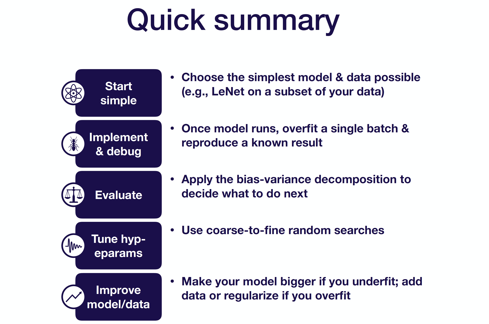

# Phase 3: ML Model Training

## 1. Model selection and creation
The type of model and basic approach should be set during the planning stage, but options are:

- supervised learning
- unsupervised learning
- deep learning
- reinforcement learning

As discussed previously, a good state-of-art understanding of the current domain is needed. If unsure, run a few spikes on model exploration is welcome.

Besides the model, the framework and infrastructure were also planned during the planning stage. We should review these and adjust it based on our dataset status.

## 2. Model Training and Debugging
Debugging ML model is hard. If your model is performing worse, there are four major reasons:

- Implementation bugs
- Hyper-parameter choices
- Data/model fit
- Dataset construction

Each of the above can bring bad performance and cannot be easily debug alone. A simple strategy will be start from a very simple architecture and basic baseline model for your application, and then improve it step by step.

Take deep learning models for example:

- Choose simple architecture:
    LeNet to ResNet for images.
    LSTM for sequences, later with attention model or WaveNet-like model.
    Fully-connected network with one hidden layer for all other tasks.
    
- Use sensible hyper-parameter defaults:
    Adam optimizer with a “magic” learning rate value of 3e-4.
    ReLU activation for fully-connected and convolutional models and TanH activation for LSTM models.
    He initialization for ReLU and Glorot initialization for TanH.
    No regularization and data normalization.

- Normalize data inputs: 
    subtracting the mean and dividing by the variance.

- Simplify the problem:
    Working with a small training set around 10,000 examples.
    Using a fixed number of objects, classes, input size, etc.
    Creating a simpler synthetic training set like in research labs.

The 5 most common bugs in deep learning models include:

- Incorrect shapes for tensors.
- Pre-processing inputs incorrectly.
- Incorrect input to the loss function.
- Forgot to set up train mode for the network correctly.
- Numerical instability - inf/NaN.

3 pieces of general advice for implementing models:
- Start with a lightweight implementation.
- Use off-the-shelf components such as Keras if possible, since most of the stuff in Keras works well out-of-the-box.
- Build complicated data pipelines later.

The first step is to get the model to run:
- For shape mismatch and casting issues, you should step through your model creation and inference step-by-step in a debugger, checking for correct shapes and data types of your tensors.
- For out-of-memory issues, you can scale back your memory-intensive operations one-by-one.
- For other issues, simply Google it. StackOverflow would be great most of the time.

The second step is to have the model overfit a single batch:
- Error goes up: Commonly this is due to a flip sign somewhere in the loss function/gradient.
- Error explodes: This is usually a numerical issue, but can also be caused by a high learning rate.
- Error oscillates: You can lower the learning rate and inspect the data for shuffled labels or incorrect data augmentation.
- Error plateaus: You can increase the learning rate and get rid of regulation. Then you can inspect the loss function and the data pipeline for correctness.

The third step is to compare the model to a known result:
- The most useful results come from an official model implementation evaluated on a similar dataset to yours.
- If you can’t find an official implementation on a similar dataset, you can compare your approach to results from an official model implementation evaluated on a benchmark dataset.
- If there is no official implementation of your approach, you can compare it to results from an unofficial model implementation.
- Then, you can compare to results from a paper with no code, results from the model on a benchmark dataset, and results from a similar model on a similar dataset.
An under-rated source of results come from simple baselines, which can help make sure that your model is learning anything at all.

## 3. Model Tests:

In the training phase, make sure:

- Full training pipeline from raw data to model is tested
- Tests should run less in a day
- Catches upstream regressions

