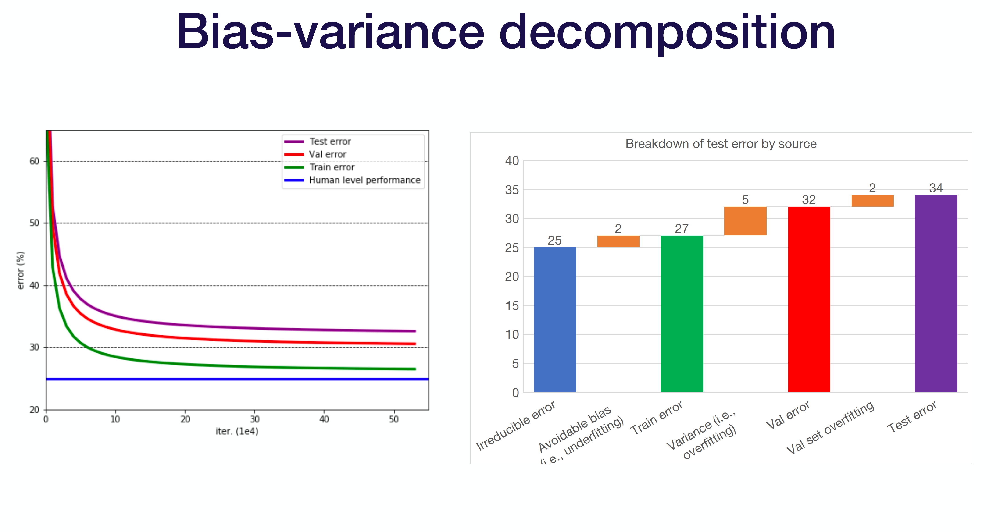
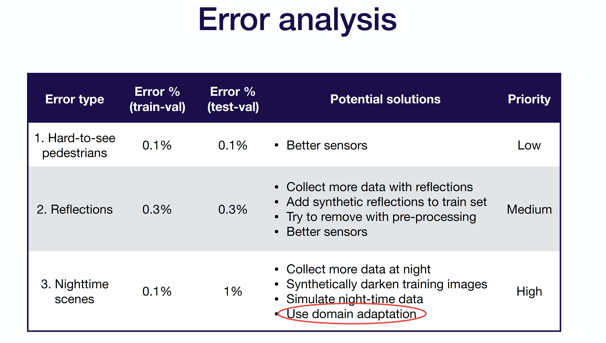

# Phase 4: ML Model Evaluation

With the metrics you designed, now it's time to evaluate your model for next steps.

## Bias-variance decomposition
You want to apply the bias-variance decomposition concept here: Test error = irreducible error + bias + variance + validation overfitting.

After the error decomposition, you can find whether your model is under-fitting, over-fitting, or data distribution.

## Improve
Now it's time to actually act on the evaluation and improve your model. Normally, the actions should be acted in the following order:

### 1. Address under-fitting

Add model complexity → Reduce regularization → Error analysis → Choose a more complex architecture → Tune hyper-parameters → Add features.

### 2. Address over-fitting

Add more training data → Add normalization → Add data augmentation → Increase regularization → Error analysis → Choose a more complex architecture → Tune hyper-parameters → Early stopping → Remove features → Reduce model size.

### 3. Address distribution shift

Analyze test-validation errors and collect more training data to compensate.

Analyze test-validation errors and synthesize more training data to compensate.

Apply domain adaptation techniques to training and test distributions.

### 4. Re-balance the dataset if needed.

If the model performance on the test & validation set is significantly better than the performance on the test set, you over-fit to the validation set.

When it does happen, you can recollect the validation data by re-shuffling the test/validation split ratio.

## Hyper-parameter Tuning

We can always introduce hypor-parameter tuning tools like Sigopt. If you decide to do it by yourself, then there are the general rules.

Choosing which hyper-parameters to optimize is not an easy task since some are more sensitive than others and are dependent upon the choice of model.
- Low sensitivity: Optimizer, batch size, non-linearity.
- Medium sensitivity: weight initialization, model depth, layer parameters, weight of regularization.
- High sensitivity: learning rate, annealing schedule, loss function, layer size.

To tune your hyper-parameter, you can:

- Method 1 is manual optimization:
    For a skilled practitioner, this may require the least amount of computation to get good results.
    However, the method is time-consuming and requires a detailed understanding of the algorithm.

- Method 2 is grid search:
    Grid search is super simple to implement and can produce good results.
    Unfortunately, it’s not very efficient since we need to train the model on all cross-combinations of the hyper-parameters. It also requires prior knowledge about the parameters to get good results.

- Method 3 is random search:
    Random search is also easy to implement and often produces better results than grid search.
    But it is not very interpretable and may also require prior knowledge about the parameters to get good results.

- Method 4 is coarse-to-fine search:
    This strategy helps you narrow in only on very high performing hyper-parameters and is a common practice in the industry.
    The only drawback is that it is somewhat a manual process.

- Method 5 is Bayesian optimization search:
    Bayesian optimization is generally the most efficient hands-off way to choose hyper-parameters.
    But it’s difficult to implement from scratch and can be hard to integrate with off-the-shelf tools.
    Can be very computational expensive.

## Tests

There are some important tests need to conduct during the model evaluation stage. The tests can be classified into validation tests and functionality tests.

As usual, tests need to be conducted for this phase. Key tests are:

- Model specs are reviewed and submitted
- Offline and online metrics correlate.
- All hyperparameters have been tuned
- The impact of model staleness is known
- A simpler model is not better
- Model quality is sufficient on important data slices
- The model is tested for considerations of inclusion. For special examples and critical subpopulations.

- Validation tests:
    Validation tests are designed to test prediction system on validation dataset. The test should start from processed data in memory, run less in an hour and catches model regressions.

- Functionality tests:
    Functionality tests are designed to test prediction system on a few important examples to make sure prediction system works as expected. It should be run in less in 5 mins and catches code regressions. 