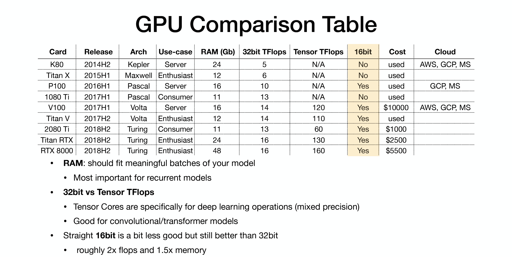
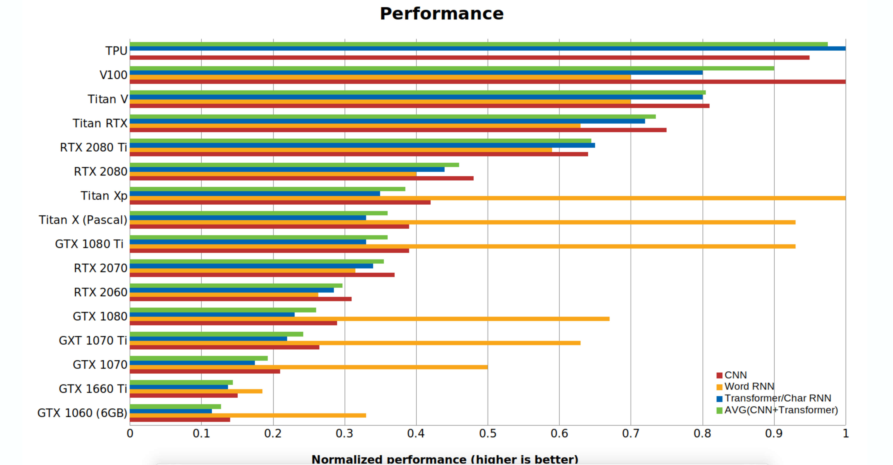

# Phase 5: ML Model Deployment and Monitoring

A machine learning model can only begin to add value to an organization when that model's insights routinely become available to the users for which it was built. The process of taking a trained ML model and making its predictions available to users or other systems is known as deployment.

Before we dig into the deployment, let's first take a look at the whole ML pipeline structure:

This is very self-explanatory.

## Planning deployment

In the phase 1, we've already planned how we're going to the deployment. Topics such like model format, model runtime, deployment hardware and infrastructure should already be discussed and can be improved through the whole ML pipeline. Below are a few topics we need to review:

1. Model format for making predictions.
e.g. onnx format, .h5 format, .tfrecord format?

2. Runtime for inference: 
    - Where it's going to run and the hardware?
        e.g. cloud (aws ec2? ecs? ), edge, on-prem, CPU, GPU, FPGA?

    - what inference model we're going to use?
        e.g. onnxruntime? tensorrt? aws sagemaker neo?

    - How to run the inference:
        e.g. batch predictions, or online near real-time predictions, or real-time predictions.

3. Application Deployment:
    e.g. aws beanstalk? docker container? on cloud solutions: aws sagemaker? azure ml? web deployment with Rest API, serving predictions in response to canonically-formatted HTTP requests?

## Software Interface

ML is a combination of research and engineering. Sometime you may face the fact that your ML decided to change to another deployment runtime, or use another framework. For example, you have some ML engineers develop models with Tensorflow and then you have another team works on Pytorch. Then a right software interface can make your deployment much easier when handling models across different frameworks and languages.

## ML Computing Hardware:

ML is heavily relied on computing hardwares. When talking about compute needs, we can basically divide the needs into three categories: 

Development Needs, Training needs, and inference needs.

- Development needs:
    writing/debugging/validating = > local desktop or cloud instance with GPU.

- Training needs:
    train your model in the scale => local GPU clusters or cloud GPU clusters

- Inference needs:
    take the trained model and make predictions => local scalable GPU clusters or cloud GPU clusters, or edge device with CPU,GPU or FPGA 

CPU:
- fewer cores, but more powerful cores.

GPU: 
- Lots of cores, but dumber cores.
- Nvidia V.S. AMD
    - Nvidia:
         GTX 1080 Ti => Titan RTX (tensor core: specialized hardware for 4x4 matrix multiply, mixed precision)
    - Programming GPUs:
        - CUDA (Nvidia only): c like code runs directly on GPU. 
        - OpenCL: similar to CUDA but runs on anything. 
- Google TPUS:
    - Fastest option 
    - Only on GCP

 
 

FPGA:

- An FPGA provides an extremely low-latency, flexible architecture that provides deep learning acceleration in a power-efficient solution.

## Web Deployment:

Nowadays, less and less firms choose to deploy the code to local machines because of lack of scalability. More firms choose to use cloud instance. 

You basically have four options:

- You can deploy the code to Virtual Machines, and then scale by adding instances.
- You can deploy the code as containers, and then scale via orchestration.
- You can deploy the code as a “server-less function.” (CPU only)
- You can deploy the code via a model serving solution.

The idea is, try first to inference with CPU. If you are making CPU inference, you can get away with scaling by launching more servers (Docker), or going serverless (AWS Lambda).

If you are using GPU inference, things like TF Serving and Ray Serve become useful with features such as adaptive batching.

## Embedded and mobile device deployment:

Embedded and mobile devices have low-processor with little memory, which makes the process slow and expensive to compute. Often, we can try some tricks such as reducing network size, quantizing the weights, and distilling knowledge.

Embedded and mobile PyTorch/TensorFlow frameworks are less fully featured than the full PyTorch/TensorFlow frameworks. Therefore, we have to be careful with the model architecture. An alternative option is using the interchange format.
- Mobile machine learning frameworks are regularly in flux: Tensorflow Lite, PyTorch Mobile, CoreML, MLKit, FritzAI.
- The best solution in the industry for embedded devices is NVIDIA.
- The Open Neural Network Exchange (ONNX for short) is designed to allow framework interoperability.

Some edge device information:

There has been launched various devices such as Nvidia Jetson TX1, Nano, TX2, Xavier, Raspberry pi, etc with having a programming language binding support like python, c++, etc. by which we can deploy the deep learning model on this devices.These devices have a decent CPU memory, GPU memory with a good resolution camera at an affordable price. 

There are ways to scale down neural networks to fit in our edge devices. An alternate (or complementary) method would be to scale up the performance of the microprocessor.

1. Raspberry pi 4:

The Raspberry Pi is a low cost, credit-card sized computer that plugs into a computer monitor or TV, and uses a standard keyboard and mouse. Configuration of this device contains Ram of 4GB, 2 × USB 3.0 ports, 2 x USB 2.0 Ports, 2 × micro HDMI ports supporting up to 4Kp60 video resolution, Micro SD card slot for loading the operating system and data storage.

Pricing: $61.99 on amazon

Models that can be run on Raspberry pi 4

For object Detection
— SSD MOBILE NET- 40 FPS
— TinyYOLOV2 -3 FPS
— OpencvDNN- 5 FPS

For Pose estimation
— SSD MOBILE NET with Open Pose- 7 FPS
Face Detection and Recognition

— OpencvDNN — 3 FPS
— Python Face Recognition Library- 2.5 FPS  

2. Nvidia Jetson Nano Series

NVIDIA Jetson Nano enables the development of millions of new small, low-power AI systems. It opens new worlds of embedded IoT applications, including entry-level Network Video Recorders (NVRs), home robots, and intelligent gateways with full analytics capabilities. Nano is a device that is slightly better than raspberry pi 4. The difference is it also provides GPU memory partition which enhances the speed of the model.
Pricing:$99.00 Amazon

3. Azure stack edge with FPGA, or with GPU
4. Coral devices with Edge TPU

## A/B Testing in Machine Learning:

When rolling out ML product or new ML models, we need to know whether this model is better than nothing or previous model in the real world situation. Then A/B testing comes to play. Many cloud providers such as AWS and Google offers A/B testing tools. And we also need to consider the model roll out strategy.

1. Single Deployment

Intelligence is deployed all at once to all users simultaneously. This is the simplest solution but is problematic when the system makes high-cost mistakes.

2. Silent Intelligence

Also known as "shadow mode," silent intelligence runs new models in parallel to existing models, but users do not see predictions of the new model. This provides an extra check on the quality of model predictions, but you don’t get to see how users react to the model.

3. Controlled Rollout

Provides a small subset of users outputs from the new model while the majority of users continue to see the previous model. Data from these interactions is used to gauge when more users should see the new model. Allows you to control the downside of an ineffective new model but is complex to implement.

4. Flighting

Flighting allows you to run statistical tests to measure which new models perform best. This enables you to run online A/B tests.

## Maintenance and monitoring

the moment you deployed your model, your model performance starts degrading because your model interacts with the real-world data and change the data distribution. "concept drifting". Therefore it's important to monitor your output of the whole ML system.

We can consider some tools offered by cloud providers, or Domino data lab.

Closing the Flywheel: use feedback from models to further train your model.

Monitor business goals, some key metrics:

- Number of predictions made?
- percentage of confident predictions?
- User-corrected predictions?

## Tests:

In deployment stage, the tests need to conduct is more into ML infrastructure tests and monitoring tests.

1. ML infrastructure tests:
- The ML inference pipeline is Integration tested.
- Serving models can be rolled back.

2. Monitoring Tests:
- Dependency changes result in notification
- Training and serving are not skewed
- Models are not too stale and numerically stable
- Computing performance has not regressed
- prediction quality has not regressed

We can also start looking into some CI tools on the market:

- CircleCI/Travis/etc: SaaS for continuous integration, every push kicks off a cloud job can be defined as commends in a Docker container, no GPUs
- Jenkins/ Buildkite: flexible on local hardware, cloud and mixed. more advanced option.

## Final report and Project Review