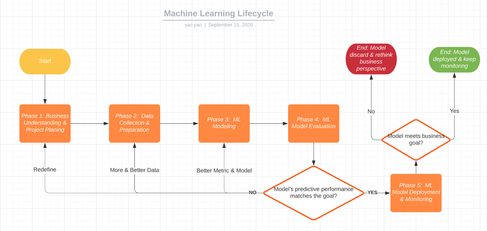

# ML-strategy
Artificial Intelligence (AI) market is posing to become billions of dollar industry in next few years, as global spending by nations on AI is likely to touch around $35.8 billion in 2029 which reports a growth of 44% over the amount spent in year 2018.Such, impressive growth shows, AI holds huge potential to attract big organizations as well as small enterprises attracting them to implement AI-enabled services for better growth in the business.

However, the truth is, 85% of Machine Learning projects fail in two years.

Survey Statistic Why AI/ML Projects Fail:
- 78% of AI/ML Projects Shut ate some stage Before Deployment
- 81% Admit the process of training AI with data is more difficult than they expected
- 76% struggle by attempting to label or annotate the training data on their own.
- 63% try to build their own labeling and annotation automation technology.

There are many talents on the market with the ability to explain a machine learning model in great details, but much fewer who actually engineered a ML product End-to-End. It’s easier for great engineers to pick up ML knowledge, but it’s a lot harder for ML experts to become great engineers. I've seen many companies with skillful machine learning experts but struggled to get their product out. Therefore, there has been a lot of talk on whether the AI bubble will burst. A large portion of AI investment is in self-driving cars, and as fully autonomous vehicles are still far from being a commodity, some hypothesize that investors will lose hope in AI altogether. In the future, there might be fewer companies that can afford to do ML research, but there will be no shortage of companies that need tooling to bring ML into their production.

That's the motivation of this ML project strategy. We want to use our extensive knowledge to fill in the gaps between machine learning, engineering, and business. We want to provide an End-to-End handbook for you to help you engineer your ML product.

The lifecycle of modern ML projects can be summarized into 5 phase:
- Phase 1: Business Understanding and Project Planning
- Phase 2: Data Collection and Preparation
- Phase 3: ML Model Training
- Phase 4: ML Model Evaluation
- Phase 5: ML Model Deployment and Monitoring

Each phase will be discussed in the following sections.

# Reference
CRISP-DM
[Machine Learning Checklist](https://towardsdatascience.com/task-cheatsheet-for-almost-every-machine-learning-project-d0946861c6d0)
